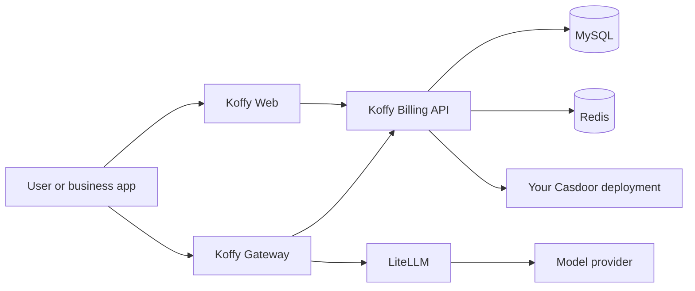

# Koffy

[简体中文](README.zh-CN.md)

Koffy is a self-hosted account, billing, and AI gateway for teams running multiple AI applications. It combines a shared user center, points and subscription entitlements, recharge orders, usage metering, model routing, and an OpenAI-compatible gateway.

> Koffy uses [Casdoor](https://casdoor.org/) for identity management. Both Compose examples start an empty Casdoor service, but Koffy does not create its organization, application, certificate, or optional SMS provider. You must complete that setup before login and registration work.

## What is included

- **Koffy Billing API**: users, wallets, points, subscriptions, entitlements, recharge orders, profiles, and administration APIs.
- **Koffy Gateway**: application authentication, user authentication, rate limits, model routing, pre-authorization, and final usage settlement.
- **Koffy Web**: user center and administration console built with React, Vite, and TypeScript.
- **LiteLLM integration**: routes requests to OpenAI-compatible model providers.
- **Optional integrations**: WeChat login, WeChat Pay, Tencent CAPTCHA, and SMS through a Casdoor SMS provider.

## Architecture



See [docs/architecture.md](docs/architecture.md) for service boundaries and request flows.

## Quick Start

### Prerequisites

- Docker Engine 24+ with Docker Compose v2
- The Casdoor organization and application settings described below
- A Casdoor organization, application, client ID, client secret, and application certificate

### 1. Start the local dependencies

```bash
cp .env.example .env
docker compose -f docker-compose.local.yml up -d mysql redis casdoor litellm
```

Open `http://localhost:8000` and initialize Casdoor. Create an organization and application, enable the password grant required by Koffy's phone/password login, and add this redirect URL:

```text
http://localhost:3000/auth/callback
```

Copy the Casdoor client ID, client secret, certificate, organization name, and application name into `.env`. Detailed settings are in [docs/deployment.md](docs/deployment.md#casdoor-setup).

### 2. Start Koffy

```bash
docker compose -f docker-compose.local.yml up --build -d
```

The first MySQL startup applies `migrations/001_init.sql` and the local demo data in `migrations/002_seed_local.sql`.

| Service | URL |
| --- | --- |
| Koffy Web | `http://localhost:3000` |
| Billing API | `http://localhost:8080` |
| Koffy Gateway | `http://localhost:8081` |
| Casdoor | `http://localhost:8000` |
| LiteLLM | `http://localhost:4000` |

Check that the APIs are ready:

```bash
curl http://localhost:8080/readyz
curl http://localhost:8081/readyz
```

### 3. Test the gateway

Local mode accepts `X-User-ID` for development. The seed creates the application key `local-dev-app-key` and user `demo-user`.

```bash
curl http://localhost:8081/v1/chat/completions \
  -H 'Content-Type: application/json' \
  -H 'X-App-Key: local-dev-app-key' \
  -H 'X-User-ID: demo-user' \
  -H 'Idempotency-Key: quick-start-001' \
  -d '{"model":"openai-chat-default","messages":[{"role":"user","content":"hello"}]}'
```

Set a real `OPENAI_API_KEY` in `.env` to receive a model response. With the placeholder value, the provider call fails and Koffy releases the reserved points as designed.

## Production

The production Compose example starts the complete stack on a blank Docker host. Prepare the environment, private runtime configs, and TLS certificates first:

```bash
cp production.env.example production.env
cp deployments/nginx/koffy.example.com.conf.example deployments/nginx/koffy.conf
cp deployments/litellm/config.example.yaml deployments/litellm/config.yaml
# Edit production.env and the copied configs; place certificates in ./certs.
docker compose --env-file production.env -f docker-compose.prod.example.yml up -d
```

On the first MySQL startup, Compose creates the `koffy` and `casdoor` databases and applies `migrations/001_init.sql`. It never loads local demo data in production. Nginx exposes the fresh Casdoor service before Koffy is healthy; complete the organization/application setup, update `production.env`, and recreate the three Koffy application containers.

Do not expose the Billing API directly. The included Nginx example routes `/api/` and `/auth/` through the same HTTPS origin as Koffy Web so session cookies work correctly.

See [docs/deployment.md](docs/deployment.md) for the complete production checklist.

## Development

```bash
go test ./...

cd web
npm ci
npm run dev
```

The Vite development server proxies `/api` and `/auth` to `http://localhost:8080` by default.

## Documentation

- [Architecture](docs/architecture.md)
- [Chinese project introduction](README.zh-CN.md)
- [Deployment and Casdoor setup](docs/deployment.md)
- [Application integration](docs/app-integration.md)
- [API reference](docs/api.md)
- [Brand and UI customization](docs/brand-ui-style-guide.md)
- [Security policy](SECURITY.md)
- [Contributing](CONTRIBUTING.md)

## Status

Koffy is currently **v0.1.0**. Interfaces may evolve before v1.0. Review the security and operational assumptions before using it for production payments.

## License

Licensed under the [Apache License 2.0](LICENSE).
