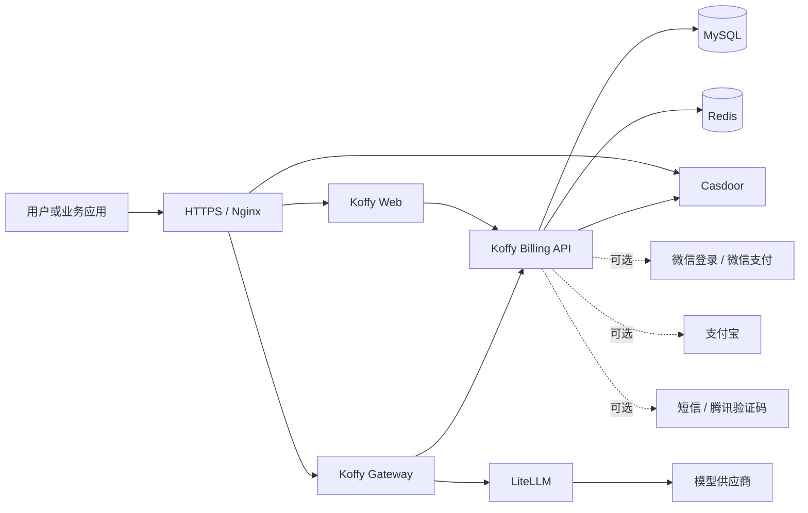
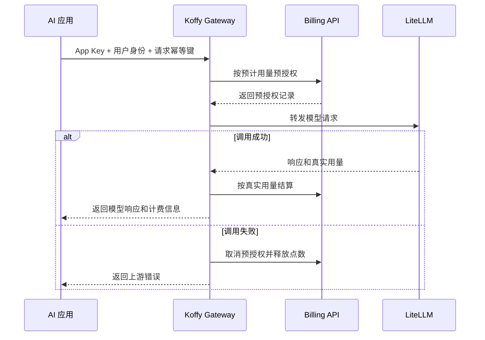

# Koffy

<p align="center">
  
</p>

[English](README.en.md)

Koffy 是一个面向多 AI 应用的开源统一账号、计费与模型网关底座。

## 为什么开发 Koffy

开发 Koffy 的初衷，是我们需要一套能够让多种 AI 应用灵活接入的公共底座：不同应用共享同一套用户身份和资产体系；不同模型供应商可以被统一调度、计量和计费；用户可以通过国内常用的登录与支付方式完成注册、充值和购买套餐；产品采用“先充值或购买套餐，再按量使用”的模式，而不是要求用户绑定信用卡并持续订阅。

我们没有找到一个开源项目能同时覆盖统一鉴权、多应用接入、模型路由、精确计费、套餐权益、国内支付和国内用户习惯，因此开发并开源了 Koffy。它不是某个 AI 产品的外壳，而是可以被多个 AI 产品共同使用的基础设施。

## Koffy 能做什么

- **统一用户体系**：多个 AI 应用共享 Casdoor 身份、Koffy 用户中心和登录状态。
- **多应用隔离**：每个业务应用拥有独立 App Key、定价、套餐、模型权限和调用记录。
- **统一模型网关**：提供 OpenAI 兼容接口，通过 LiteLLM 接入不同模型供应商。
- **精确计量计费**：支持 token、图片、视频时长和业务单位，采用预授权、结算、取消的完整账务流程。
- **点数与套餐权益**：同时支持充值余额和按月套餐额度，保留不可变流水，便于审计与追踪。
- **国内化账号体验**：支持手机号注册、登录、找回密码、短信验证、微信登录和可选的腾讯验证码。
- **国内化支付方式**：内置微信支付 Native / JSAPI 与支付宝电脑网站、手机网站支付流程，适合充值后使用的消费模式。
- **可视化运营后台**：管理应用、定价、套餐、用户资产、调用、支付、模型路由和品牌资源。
- **可自托管与可换品牌**：用户中心和管理后台可分别上传 Logo 与 favicon，升级镜像不会覆盖线上品牌。

## 系统架构



Koffy 将身份、账务和模型流量拆成清晰的服务边界：

| 组件 | 职责 |
| --- | --- |
| Koffy Web | 用户中心和管理后台 |
| Koffy Billing API | 用户映射、会话、点数、套餐、权益、订单、支付和管理接口 |
| Koffy Gateway | 应用鉴权、用户鉴权、限流、模型路由、用量预授权与结算 |
| Casdoor | 用户身份、密码、组织、第三方登录和可选短信发送 |
| LiteLLM | 模型供应商适配和上游请求 |
| MySQL / Redis | 持久账务数据、Casdoor 数据、会话和临时控制状态 |

详细设计见 [架构文档](docs/architecture.md)。

## 一次 AI 调用如何计费



应用、用户和幂等键共同标识一次逻辑请求。即使上游重试，也不会重复扣费。

## 五分钟本地启动

### 前置条件

- Docker Engine 24+
- Docker Compose v2

Koffy **依赖 Casdoor**。本地 Compose 会启动一个空的 Casdoor 容器，但不会替你创建组织、应用和证书，这部分需要在 Casdoor 后台完成。

### 1. 启动基础服务

```bash
cp .env.example .env
docker compose -f docker-compose.local.yml up -d mysql redis casdoor litellm
```

打开 `http://localhost:8000` 初始化 Casdoor，然后：

1. 创建组织和应用。
2. 添加回调地址 `http://localhost:3000/auth/callback`。
3. 启用 Koffy 手机号/密码登录所需的密码授权模式。
4. 将 Client ID、Client Secret、应用证书、组织名和应用名填入 `.env`。
5. 如需短信验证码，在 Casdoor 创建短信 Provider，并填写 `REGISTRATION_SMS_PROVIDER`。

### 2. 启动完整 Koffy

```bash
docker compose -f docker-compose.local.yml up --build -d
```

| 服务 | 地址 |
| --- | --- |
| Koffy Web | `http://localhost:3000` |
| Billing API | `http://localhost:8080` |
| Koffy Gateway | `http://localhost:8081` |
| Casdoor | `http://localhost:8000` |
| LiteLLM | `http://localhost:4000` |

首次启动 MySQL 时会自动执行 `migrations/001_init.sql` 和本地演示数据 `migrations/002_seed_local.sql`。

### 3. 测试网关

本地模式允许使用 `X-User-ID`。演示数据包含应用密钥 `local-dev-app-key` 和用户 `demo-user`：

```bash
curl http://localhost:8081/v1/chat/completions \
  -H 'Content-Type: application/json' \
  -H 'X-App-Key: local-dev-app-key' \
  -H 'X-User-ID: demo-user' \
  -H 'Idempotency-Key: quick-start-001' \
  -d '{"model":"openai-chat-default","messages":[{"role":"user","content":"你好"}]}'
```

在 `.env` 中配置真实 `OPENAI_API_KEY` 后可获得模型响应。使用占位密钥时，上游调用会失败，Koffy 会按设计释放预授权点数。

## 生产部署

生产 Compose 面向一台空白 Docker 主机，一次启动 MySQL、Redis、Casdoor、LiteLLM、Koffy 和 Nginx：

```bash
cp production.env.example production.env
cp deployments/nginx/koffy.example.com.conf.example deployments/nginx/koffy.conf
cp deployments/litellm/config.example.yaml deployments/litellm/config.yaml
# 修改域名、证书路径、模型路由和所有 replace-me 配置，并把证书放入 ./certs。
docker compose --env-file production.env -f docker-compose.prod.example.yml up -d
```

生产首次启动只执行 `001_init.sql`，不会写入本地演示数据。Nginx 不等待 Koffy 应用健康即可提供 Casdoor 入口；完成组织和应用配置后，将凭据写入 `production.env` 并重新创建三个 Koffy 应用容器。

线上个性化数据不会被镜像升级覆盖：Logo、favicon、头像和业务数据保存在 MySQL 卷；Nginx、LiteLLM、证书、支付密钥和 `production.env` 保存在 Git 忽略的宿主机文件中。升级时不要执行 `docker compose down -v`。

完整步骤见 [部署文档](docs/deployment.md)。

## 可选集成

- Casdoor 短信 Provider
- 腾讯云验证码
- 微信公众号网页授权
- 微信开放平台网站扫码登录
- 微信支付 Native / JSAPI
- 支付宝电脑网站 / 手机网站支付
- LiteLLM 支持的模型供应商

这些能力默认关闭或使用中性占位配置，不影响核心账号、账务和网关功能。

## 项目状态

当前版本为 **v0.2.1**。在 v1.0 之前，接口和部署约定仍可能演进；涉及生产支付和真实资产时，请先完成安全审查、备份和恢复演练。

## 文档

- [架构说明](docs/architecture.md)
- [部署与 Casdoor 配置](docs/deployment.md)
- [业务应用接入](docs/app-integration.md)
- [API 参考](docs/api.md)
- [品牌与 UI 定制](docs/brand-ui-style-guide.md)
- [安全策略](SECURITY.md)
- [贡献指南](CONTRIBUTING.md)

## 开源协议

Koffy 使用 [Apache License 2.0](LICENSE) 开源。
