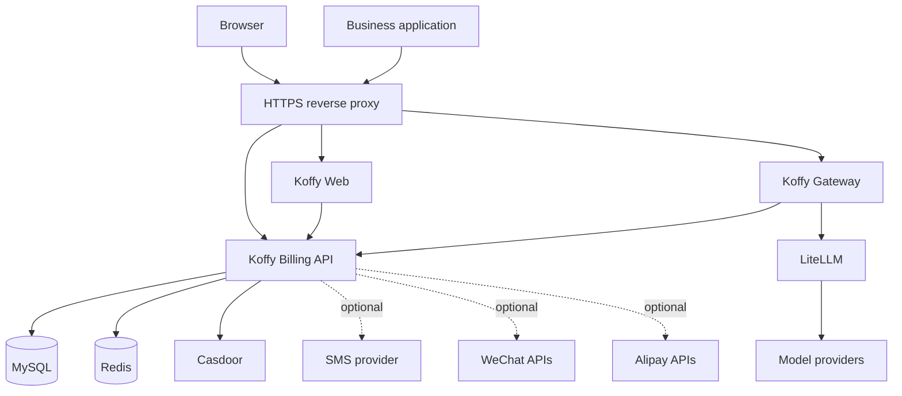
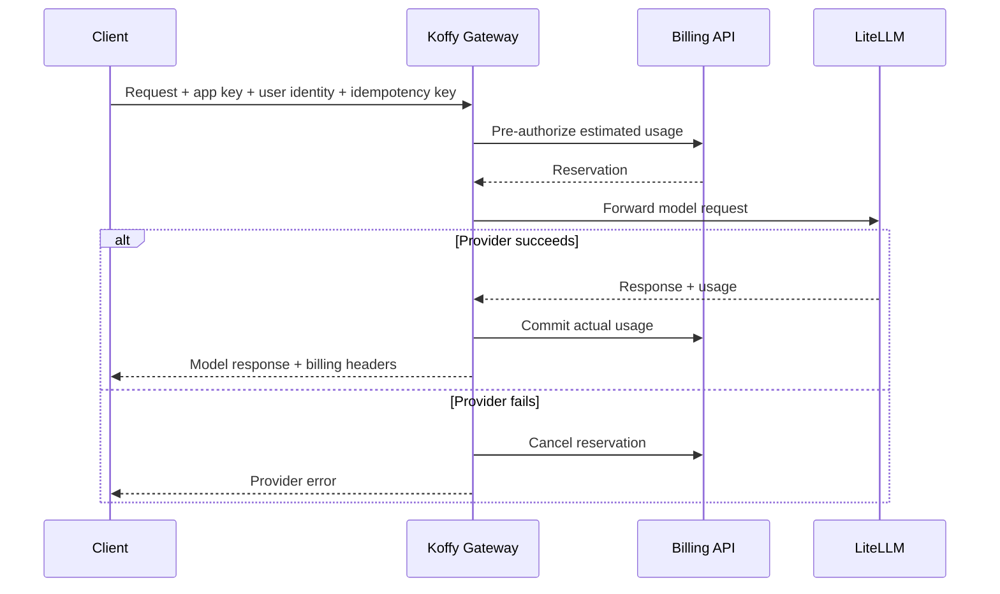

# Architecture

Koffy separates identity, account/billing state, and model traffic into independently deployable services.

The local and production Compose examples both provide the complete service topology. Production adds Nginx, TLS mounts, persistent Redis storage, and ignored runtime configuration files while preserving the same service boundaries.

## System context

## Service responsibilities

| Component | Owns | Does not own |
| --- | --- | --- |
| Koffy Web | User center and admin UI | Authentication records, balances, model proxying |
| Billing API | Koffy users, sessions, wallets, ledgers, plans, entitlements, orders, admin APIs | Casdoor source identities, model-provider protocol translation |
| Koffy Gateway | App-key validation, user validation, rate limits, model routing, usage reservation and settlement | User-facing account management |
| Casdoor | Source identities, passwords, organization membership, optional SMS delivery | Wallets, points, subscriptions, usage billing |
| LiteLLM | Provider adapters and upstream model requests | Koffy application authorization and billing |
| MySQL | Durable Koffy state; Casdoor may use a separate database on the same server | Session acceleration and request throttling |
| Redis | Koffy sessions and transient controls | Durable billing records |

## Authentication flow

1. The browser opens Koffy Web and calls the same-origin Billing API.
2. Phone/password login is verified against Casdoor. WeChat login resolves or creates a Casdoor identity through Koffy's callback handlers.
3. Koffy synchronizes the minimal profile required for billing into its own `users` table.
4. The Billing API issues a Koffy session. External business applications receive a short-lived, one-time login exchange code instead of a session in the URL.
5. Production clients call the Gateway with a Casdoor bearer token; local development may use `X-User-ID` only when `APP_ENV=local`.

Casdoor remains the identity authority. Koffy's user row is an operational projection used for wallet ownership, authorization, and display.

## AI request and billing flow

Every billable request is keyed by application, user, and idempotency key. Durable reservations and ledgers prevent provider retries from charging the same logical request twice.

## Data ownership

- `users` links a Koffy user to a Casdoor owner/name pair.
- `wallets` and `wallet_ledger` store point balances and immutable changes.
- `user_subscriptions`, `entitlement_balances`, and `entitlement_ledger` store plan allowances.
- `usage_requests` and `usage_reservations` record authorization, provider usage, and settlement.
- `recharge_orders` and `payment_events` record payment state and idempotent callbacks.
- authentication state, login codes, and phone verification codes are short-lived and periodically cleaned.
- uploaded user-center/admin logos and favicons are stored in `branding_assets`; avatars are stored in `user_avatar_assets`, so image upgrades do not replace deployment branding.

The fresh-install schema is in `migrations/001_init.sql`. `002_seed_local.sql` contains development-only demo records. Published releases that change existing schemas add forward migration files such as `migrations/003_add_alipay.sql`.

Container images contain neutral fallback assets only. Deployment-specific Nginx and LiteLLM configuration, TLS certificates, payment keys, and environment values live in ignored host files; durable application and Casdoor state lives in Docker volumes.

## Trust boundaries

- Expose only Koffy Web, Koffy Gateway, and the chosen Casdoor public endpoint.
- Keep Billing API, MySQL, Redis, and LiteLLM on a private Docker network.
- Treat app keys, internal API keys, Casdoor secrets, model-provider keys, and payment keys as secrets.
- Terminate TLS before Koffy and preserve `Host`, `X-Forwarded-For`, and `X-Forwarded-Proto` headers.
- Use the same origin for Koffy Web and `/api/`/`/auth/` so secure session cookies behave consistently.

## Extensibility

Business applications integrate through the Gateway and Billing API contracts rather than accessing tables directly. New model providers belong behind LiteLLM; new identity providers belong in Casdoor or explicit Billing API authentication handlers; new billing units must update schema, contracts, reservation logic, admin UI, and tests together.
